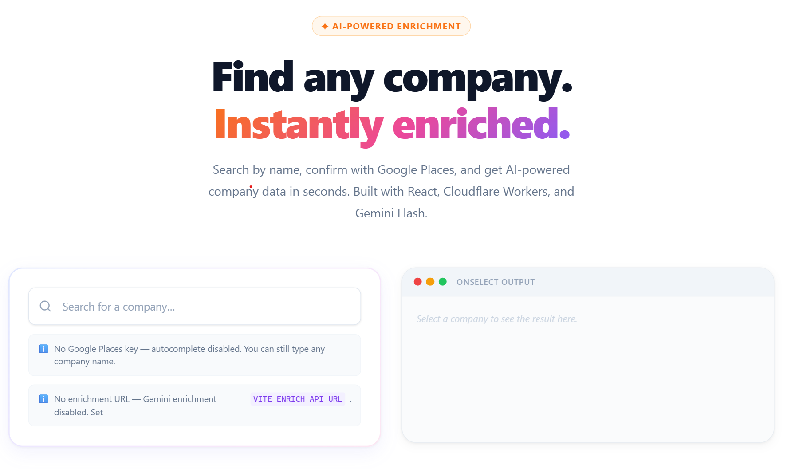

# CompanySearch

[](https://github.com/asmundervik/CompanySearch/actions/workflows/ci.yml)
[](LICENSE)

A polished, reusable React component that lets users search for a company name — with optional Google Places autocomplete — and instantly enriches the result with AI-powered company data via Gemini Flash.

Built to be embedded in onboarding flows, signup forms, or anywhere you need structured company information from a user input.



---

## Features

- **Google Places autocomplete** — optional; degrades gracefully to free-text entry if no key is provided
- **Homepage URL fallback** — if Places returns no match, users can supply a homepage URL; the worker fetches and scrapes it server-side (no CORS issues) to give Gemini extra context
- **Gemini Flash enrichment** — returns structured company data: industry, description, headquarters, employee range, founding year, domain, and more
- **Schema-driven prompts** — the response schema is defined in TypeScript and drives both the Gemini prompt and response validation; they can never drift apart
- **Consumer-configurable output** — pass your own `EnrichConfig` to change what Gemini returns (e.g. NACE codes instead of free-text industry)
- **Prompt injection hardened** — implements the [OWASP LLM Prompt Injection Prevention Cheat Sheet](https://cheatsheetseries.owasp.org/cheatsheets/LLM_Prompt_Injection_Prevention_Cheat_Sheet.html) "Structured Prompts with Clear Separation" technique (StruQ research)
- **API key safe** — Gemini key lives exclusively in a Cloudflare Worker secret; it never touches the client bundle
- **CSS Modules** — fully scoped styles, zero runtime CSS-in-JS dependency; override with `--cs-*` custom properties
- **Dark mode** — automatic via `prefers-color-scheme`, or pass `theme="light" | "dark"`
- **Accessible** — `role="combobox"`, `aria-expanded`, `aria-activedescendant`, keyboard navigation (↑ ↓ Enter Escape)

---

## Project structure

```
CompanySearch/
├── src/
│   ├── components/CompanySearch/   # The reusable component
│   │   ├── CompanySearch.tsx
│   │   ├── CompanySearch.types.ts  # CompanyResult, EnrichConfig, props
│   │   ├── CompanySearch.module.css
│   │   └── index.ts
│   ├── hooks/
│   │   ├── useGooglePlaces.ts      # Lazy-loads Places API, returns suggestions
│   │   └── useCompanyEnrich.ts     # POST wrapper to the worker
│   ├── demo/                       # Standalone demo page (not part of the lib)
│   │   ├── App.tsx
│   │   ├── App.module.css
│   │   └── main.tsx
│   └── index.ts                    # Public re-export
└── worker/                         # Cloudflare Worker — proxy + enrichment
    ├── src/
    │   ├── index.ts                # Request handler
    │   ├── prompt.ts               # OWASP-structured prompt builder
    │   ├── schema.ts               # DEFAULT_ENRICHMENT_SCHEMA + helpers
    │   └── scrape.ts               # Server-side homepage fetch + HTML strip
    └── wrangler.toml
```

---

## Getting started

### 1. Clone and install

```bash
git clone https://github.com/asmundervik/CompanySearch.git
cd CompanySearch
npm install
```

### 2. Configure environment variables

```bash
cp .env.example .env.local
```

Edit `.env.local`:

```env
# Google Places Autocomplete API key (optional — autocomplete is disabled without it)
# Restrict this key to your domain in Google Cloud Console → Credentials
VITE_GOOGLE_PLACES_KEY=your_google_places_api_key

# URL of your running Cloudflare Worker
VITE_ENRICH_API_URL=http://localhost:8787
```

### 3. Set up the Cloudflare Worker

```bash
cd worker
npm install

# Copy the example secrets file
cp .dev.vars.example .dev.vars
```

Edit `worker/.dev.vars` (this file is gitignored):

```env
GEMINI_API_KEY=your_gemini_api_key_here
```

Start the worker locally:

```bash
npm run dev       # starts on http://localhost:8787
```

### 4. Start the demo

Back in the root:

```bash
npm run dev       # starts on http://localhost:5173
```

---

## Deploying the worker

```bash
cd worker

# Add your Gemini key as a secret (stored in Cloudflare, never in source)
wrangler secret put GEMINI_API_KEY

# Deploy
npm run deploy
```

After deploying, update `VITE_ENRICH_API_URL` in your frontend environment to the worker URL (e.g. `https://company-search-worker.your-subdomain.workers.dev`).

Update `ALLOWED_ORIGIN` in `worker/wrangler.toml` to your frontend domain so the worker only accepts requests from it.

---

## Component API

```tsx
import { CompanySearch } from './src'

<CompanySearch
  onSelect={(result) => console.log(result)}
  placeholder="Search for a company…"
  googlePlacesApiKey="AIza..."          // optional
  enrichApiUrl="https://..."            // optional — skips enrichment if omitted
  enrichConfig={{ fields: { ... } }}    // optional — overrides default schema
  theme="auto"                          // "light" | "dark" | "auto" (default)
/>
```

### `CompanyResult`

The shape passed to `onSelect`:

```ts
interface CompanyResult {
  name: string
  homepageUrl?: string
  source: 'google' | 'manual'
  enriched: Record<string, string | number | null>
}
```

`enriched` contains whatever keys your active schema defines — either the defaults or your custom `EnrichConfig`.

### Default enriched fields

| Key | Example value |
|-----|--------------|
| `domain` | `"stripe.com"` |
| `industry` | `"Financial Technology"` |
| `subIndustry` | `"Payment Processing"` |
| `description` | `"Provides payment infrastructure for the internet."` |
| `employeeRange` | `"1000–5000"` |
| `headquarters` | `"San Francisco, CA, USA"` |
| `founded` | `"2010"` |

---

## Custom schema (`EnrichConfig`)

You can replace the default fields with anything you want Gemini to return. The worker merges your field definitions into the prompt server-side — no prompt text ever travels from the client.

```tsx
<CompanySearch
  enrichConfig={{
    fields: {
      naceCode:      { type: 'string | null', description: 'EU NACE Rev. 2 code, e.g. J62.01' },
      naceLabel:     { type: 'string | null', description: 'NACE Rev. 2 label in English' },
      description:   { type: 'string | null', description: 'One sentence describing the company' },
      employeeRange: { type: 'string | null', description: 'Headcount range, e.g. 50–200' },
    }
  }}
  ...
/>
```

The result card renders custom fields automatically using a generic grid layout.

---

## Theming

The component exposes CSS custom properties on its root element. Override them in your stylesheet to match your design system:

```css
/* Example: use your brand color and tighter radius */
.myWrapper {
  --cs-primary:       #0ea5e9;
  --cs-primary-hover: #0284c7;
  --cs-primary-ring:  rgba(14, 165, 233, 0.18);
  --cs-primary-light: #e0f2fe;
  --cs-radius:        6px;
  --cs-radius-lg:     10px;
  --cs-font:          'Inter', sans-serif;
}
```

Full list of available properties is in [`src/components/CompanySearch/CompanySearch.module.css`](src/components/CompanySearch/CompanySearch.module.css).

---

## Security notes

- **Gemini API key** — stored as a Cloudflare Worker secret via `wrangler secret put`. Never committed to source, never sent to the browser.
- **Google Places key** — client-side by design (Google Places is a browser API). Restrict it to your domain's HTTP referrer in [Google Cloud Console](https://console.cloud.google.com/apis/credentials).
- **Prompt injection** — the worker implements [OWASP "Structured Prompts with Clear Separation"](https://cheatsheetseries.owasp.org/cheatsheets/LLM_Prompt_Injection_Prevention_Cheat_Sheet.html): all user-supplied content (company name, scraped homepage text) is wrapped in `[USER_DATA_TO_PROCESS]` section labels, and the system instructions explicitly tell the model to treat those sections as data only, never as commands.
- **Homepage scraping** — the URL is fetched by the worker (server-to-server), not the browser, so there are no CORS issues. Only `https://` URLs are accepted.

---

## API keys needed

| Key | Where it lives | How to restrict |
|-----|---------------|----------------|
| `GEMINI_API_KEY` | Cloudflare Worker secret | Never in source or client |
| `VITE_GOOGLE_PLACES_KEY` | Client JS bundle | HTTP referrer restriction in Google Cloud Console |

---

## License

MIT
